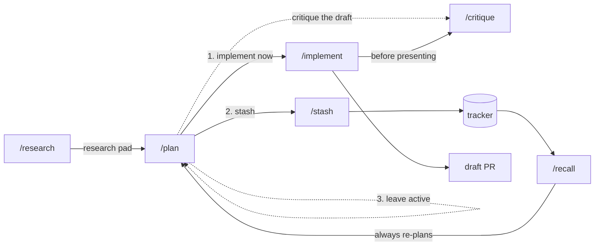

# agents

Claude Code configuration: always-on rules, plus a research, plan, and implement workflow built
on the [Solo](https://soloterm.dev) MCP server.

## Install

```bash
./scripts/install.sh
```

| Link | Contents |
|---|---|
| `~/.claude/rules/<name>.md` | always-on working agreements — **linked per file** |
| `~/.claude/skills/<name>/` | slash commands — **linked per skill** |
| `~/.claude/references` | tracker adapters for `/stash` and `/recall` — whole directory |

The script links rules and skills one at a time, so `~/.claude/rules` and `~/.claude/skills`
stay real directories you own. It leaves anything else you keep there alone. Nothing you create
locally reaches this repository, which matters because the repository is public.

`references/` is a whole-directory link because it is not a Claude Code directory. It exists so
a skill or a rule can read an adapter from a stable path, and nothing else writes there. It
holds two kinds: a tracker adapter that `/stash` and `/recall` read, and a runtime adapter that
`solo-agent-orchestration` points at before you spawn that runtime. `claude.md` and `codex.md`
are the runtime adapters. Each maps every policy in that rule to the flag that implements it,
and records the policies its runtime cannot implement at all.

An adapter is content you need at one moment rather than in every session. Runtime launch flags
belong here because a wrong flag fails the launch with a visible error. A rule keeps anything
whose absence fails silently.

Re-run the script after you **add or rename** a file. An edit to an existing file takes effect
immediately. The script prunes links into this repository whose source is gone, and it touches
nothing else. It moves anything real in the way to `~/.claude/backups/` first. Override the
repository root with `AGENTS_REPO=/path/to/agents`.

**This repository does not manage `~/.claude/settings.json` or `~/.claude/CLAUDE.md`.** Those
are machine-local and yours.

### Requirements

| | |
|---|---|
| Solo MCP | `/research`, `/plan`, `/implement`, `/critique`, `/stash`, `/recall` |
| A tracker MCP | `/stash`, `/recall` — Linear adapter included |
| Vale 3.0 or later | checking prose against `simplified-english` — `brew install vale`. CI pins 3.17.1 |
| Nothing | `/grill` and the rules |

## Rules

All seven rules load into every session.

| Rule | Description |
|---|---|
| [comment-discipline](rules/comment-discipline.md) | Admit a comment only when it says something the code cannot |
| [output-discipline](rules/output-discipline.md) | Lead with the answer, one shape per fact, and stop when done |
| [pr-first-contributions](rules/pr-first-contributions.md) | PR-first git workflow with conventional titles, draft PRs, and squash-merge descriptions |
| [simplified-english](rules/simplified-english.md) | Write short active sentences, one term per concept, and no metaphor |
| [solo-agent-orchestration](rules/solo-agent-orchestration.md) | Fan out with Solo agents, never a vendor's native sub-agent mechanism. Workers signal their own completion and report to a durable surface |
| [testing-philosophy](rules/testing-philosophy.md) | Contract-first tests through production entry points; refactor-resistant |
| [yagni](rules/yagni.md) | Build for the present need; defer what is cheap to add later |

Each description above copies that rule's `description:` frontmatter. Copy it rather than
paraphrase it, because a paraphrase drifts from the rule it describes.

### Checking prose

Vale checks `simplified-english` mechanically. `.vale.ini` and the hand-authored `styles/STE/`
style live in this repository. Run it over the markdown you changed:

```bash
vale --minAlertLevel=warning <file>.md
```

The 25-word sentence cap and the contraction check are errors. The 20-word cap, the
passive-voice check, and the gerund check are warnings, because each one needs your judgment.

The passive-voice and gerund checks use Vale's `sequence` extension, which reads part-of-speech
tags. They match a `be` form followed by a past participle or a present participle. Vale 3.17.0
or later is required, because earlier versions read sentences from paragraphs only.

A tagger reads word forms, not meaning, so both checks report some sentences that are correct.
`The waves are done` tags `done` as a past participle even though it acts as an adjective here.
Both checks are warnings for that reason: read each one and decide.

## Skills

| Skill | Purpose | Invocation |
|---|---|---|
| [`/research`](skills/research/SKILL.md) | Investigate a codebase with parallel Solo agents and write the findings to a Solo scratchpad | you or Claude |
| [`/critique`](skills/critique/SKILL.md) | Adversarial multi-model review of a diff, plan, files, or PR | you or Claude |
| [`/grill`](skills/grill/SKILL.md) | Interrogate a decision one question at a time | you or Claude |
| [`/plan`](skills/plan/SKILL.md) | Research, grill, and produce a plan in one Solo scratchpad | **you only** |
| [`/implement`](skills/implement/SKILL.md) | Decompose a plan into workers, run them, critique, present | **you only** |
| [`/stash`](skills/stash/SKILL.md) | Move active work into a durable tracker | **you only** |
| [`/recall`](skills/recall/SKILL.md) | Pull tracker work back into planning | **you only** |

Four skills have side effects: they write code, commit, or create tracker objects. Each of the
four carries `disable-model-invocation: true`, so Claude cannot decide to run it. Those four do
not appear in Claude's skill listing, so they cost no context until you invoke them.

The three advisory skills stay model-invocable and carry `when_to_use` trigger phrases. Say
"grill me on this" or "find the bugs" and the skill runs without a command name.

**No skill overrides the model.** Every skill respects your session's choice, including a `[1m]`
variant. A skill sets `effort` only where the shape of the work justifies it:

| Skill | `effort` | Why |
|---|---|---|
| `grill` | `xhigh` | pure judgment, no fan-out to multiply the cost |
| `stash`, `recall` | `medium` | mechanical mapping against an explicit adapter |
| the rest | inherits | a raise multiplies across their parallel agents |

An effort override applies for the rest of the turn, and it resets on your next prompt. For
one-off depth, put `ultrathink` in the prompt instead.



## How the system divides state

**Solo is the active working set.** Scratchpads hold research and plans. They are short-lived,
and you archive them once the work ships. Todos exist only while `/implement` runs a plan. KV
holds small orchestration pointers.

**A tracker is the durable backlog.** It holds an idea you parked for later. It also holds a
large plan whose work items each get their own research, plan, and implement cycle. Nothing
crosses that boundary automatically: `/stash` and `/recall` are always explicit.

Nothing in this repository stores your work. Research and plans live in Solo, not in git.

| Kind | Name / key | Tags |
|---|---|---|
| Research pad | `research/<YYYY-MM-DD>T<HHMM>-<topic>` | `research`, `project:<repo>` |
| Plan pad | `plan/<YYYY-MM-DD>T<HHMM>-<topic>` | `plan`, `project:<repo>` |
| Task todos | — | `plan:<slug>`, `project:<repo>`, `task:<letter>` |
| Worker reports | `<slug>/<task>` | — |
| Orchestration | `plan:<slug>:branch:<repo>` | — |

Skills use whichever Solo project is currently selected, and say which one in their first
confirmation.

## How the workflow behaves

**Every worker is a Solo agent.** `/research`, `/plan`, `/implement`, and `/critique` fan out
with `spawn_agent`, never with the host runtime's own sub-agent mechanism.
[solo-agent-orchestration](rules/solo-agent-orchestration.md) carries the policy and the
reasoning, so the policy also holds for a fan-out that no skill started. Each skill carries only
its own worker prompt and constraints.

**Every worker launches in auto-approval mode** — `--permission-mode auto` on Claude,
`--approve-for-me --no-alt-screen` on Codex. A read-only assignment is no exception. No worker
uses a bypass mode. A `--settings` deny list enforces what a worker must not do, rather than a
permission mode.

**Workers signal their own completion.** Each worker wakes the orchestrator through a zero-delay
timer as its last act, because only the worker knows that it finished. An idle timer stays as
the fallback that catches a worker which died or hung. An idle timer has no debounce, and a
worker that reasons at length emits no output and looks finished.

**Gates carry evidence for what they inferred.** A confirmation justifies the judgments it could
get wrong: why these repos, why these investigation areas, why this is out of scope. A bad guess
is then visible rather than buried. A gate prints a looked-up fact without argument. The
selected Solo project needs no justification; a repo list inferred from file references needs
one.

**`/plan` grills you.** Questions come one at a time, each with a recommended answer. The
question whose answer changes the most other answers comes first. `/plan` looks up anything the
filesystem or a tool can tell it, rather than asking you. It stops when the questions left are
details you would rather see than specify.

**The plan says what changes; `/implement` decides how it runs.** A plan declares work items
with their file scopes. It also declares the two constraints only it knows: which items must
share a worker, and which must follow another. Grouping items into workers, ordering them into
waves, and choosing a model and effort are scheduling. `/implement` decides the schedule at
execution time, against facts that are current then.

**You approve the roster before anything spawns.** `/implement` presents the worker count, the
job of each worker, and the model and effort it requests. `/implement` writes each summary so
the tier follows from it. A task described as "three localized edits against precise line
references" argues for its own tier. Adjust any model, effort, or grouping, or approve the
roster as proposed. You decide cost and parallelism here.

**The permission layer enforces the constraints rather than requesting them.** Every worker launches with git writes denied at the
permission layer, rather than prohibited in prose. Two workers that stage in one shared tree
cross-commit silently. Workers hold per-path locks, and the orchestrator commits each task's
declared paths, so history stays granular.

**Workers escalate on deviation, not on failure.** A worker that cannot self-resolve records
what it found and stops. So does a worker that would have to depart meaningfully from the
approved plan. Neither one improvises. The record is the worker's report scratchpad, and its
completion signal says that it escalated, so you have one place to look. Other workers in the
wave finish, and everything appears together at the join.

**Critique is adversarial and multi-model.** `/critique` spawns one worker per model you select:
Claude, Copilot, Kimi, or anything else enabled in Solo. Each worker tries to break the target
rather than survey it. Cross-model agreement is the confidence signal, because a defect that two
models independently find is probably real. One model gives no such signal, so a refutation pass
takes its place and drops what it refutes.

**You triage findings one at a time.** Each surviving finding arrives with its evidence and the
decision it needs. The next finding waits until you make that decision. Severity orders the
findings, and agreement breaks a tie. There is no batch report to read back through.
`/implement` hands its critique findings over in the same shape, so nobody triages a finding
twice.

## Adding a tracker

Add an adapter to `references/` that describes that tracker's object model and field mapping.
`/stash` and `/recall` own the semantics and read the adapter for the specifics. A new tracker
is therefore one file rather than two skills. See
[`references/linear.md`](references/linear.md).
