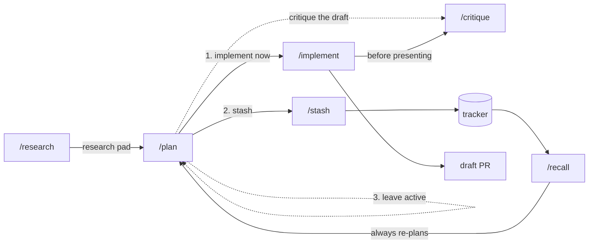

# agents

Claude Code configuration: always-on rules and a research → plan → implement workflow built on
the [Solo](https://soloterm.dev) MCP server.

## Install

```bash
./scripts/install.sh
```

| Link | Contents |
|---|---|
| `~/.claude/rules/<name>.md` | always-on working agreements — **linked per file** |
| `~/.claude/skills/<name>/` | slash commands — **linked per skill** |
| `~/.claude/references` | tracker adapters for `/stash` and `/recall` — whole directory |

Rules and skills are linked one at a time so `~/.claude/rules` and `~/.claude/skills` stay
real directories you own. Anything else you keep there is left alone, and nothing you create
locally ends up in this repository — which matters, since it is public.

`references/` is a whole-directory link because it is not a Claude Code directory. It exists
only so skills can read tracker adapters from a stable path, and nothing else writes there.

Re-run after **adding or renaming** a file; editing one takes effect immediately. Links into
this repo whose source has gone are pruned, and nothing else is touched. Anything real in the
way is moved to `~/.claude/backups/` first. Override the repo root with
`AGENTS_REPO=/path/to/agents`.

**This repository does not manage `~/.claude/settings.json` or `~/.claude/CLAUDE.md`.** Those
are machine-local and yours.

### Requirements

| | |
|---|---|
| Solo MCP | `/research`, `/plan`, `/implement`, `/critique`, `/stash`, `/recall` |
| A tracker MCP | `/stash`, `/recall` — Linear adapter included |
| Nothing | `/grill` and the rules |

## Rules

Loaded into every session.

| Rule | Description |
|---|---|
| [output-discipline](rules/output-discipline.md) | Lead with the answer, one shape per fact, stop when done — the standard is the reader's time and the signal density of what reaches them |
| [pr-first-contributions](rules/pr-first-contributions.md) | PR-first git workflow, conventional titles, draft PRs, quality gates before presenting, approval before pushing |
| [solo-agent-orchestration](rules/solo-agent-orchestration.md) | Fan out with Solo agents, never a vendor's native sub-agents; spawn, join on a timer, collect from a durable surface |
| [testing-philosophy](rules/testing-philosophy.md) | Contract-first tests through production entry points; refactor-resistant |
| [yagni](rules/yagni.md) | Build for the caller that exists; defer what is cheap to add later, decide up front what is expensive to retrofit |

## Skills

| Skill | Purpose | Invocation |
|---|---|---|
| [`/research`](skills/research/SKILL.md) | Map a codebase with parallel Solo agents → a Solo scratchpad | you or Claude |
| [`/critique`](skills/critique/SKILL.md) | Adversarial multi-model review of a diff, plan, files, or PR | you or Claude |
| [`/grill`](skills/grill/SKILL.md) | Interrogate a decision one question at a time | you or Claude |
| [`/plan`](skills/plan/SKILL.md) | Research, grill, plan → one scratchpad, then implement / stash / park | **you only** |
| [`/implement`](skills/implement/SKILL.md) | Decompose a plan into workers, run them, critique, present | **you only** |
| [`/stash`](skills/stash/SKILL.md) | Move active work into a durable tracker | **you only** |
| [`/recall`](skills/recall/SKILL.md) | Pull tracker work back into planning | **you only** |

Anything with side effects — writing code, committing, creating tracker objects — carries
`disable-model-invocation: true`, so Claude cannot decide to run it. Those four don't appear
in Claude's skill listing at all, which also means they cost no context until you invoke them.
The three advisory ones stay model-invocable and carry `when_to_use` trigger phrases, so
"grill me on this" or "tear this apart" work without remembering a command name.

**No skill overrides the model.** Your session's choice — including a `[1m]` variant — is
respected throughout. Effort is tuned only where the shape of the work justifies it:

| Skill | `effort` | Why |
|---|---|---|
| `grill` | `xhigh` | pure judgment, no fan-out to multiply the cost |
| `stash`, `recall` | `medium` | mechanical mapping against an explicit adapter |
| the rest | inherits | raising them would multiply across their parallel agents |

An effort override applies for the rest of the turn and resets on your next prompt. For
one-off depth without changing anything, put `ultrathink` in the prompt.



## How state is divided

**Solo is the active working set.** Scratchpads hold research and plans; they are short-lived
and archived once the work ships. Todos exist only while a plan is being implemented. KV holds
small orchestration pointers.

**A tracker is the durable backlog.** Ideas parked for later, and large plans whose work items each
get their own research → plan → implement cycle. Nothing crosses that boundary automatically —
`/stash` and `/recall` are always explicit.

Nothing in this repository stores your work. Research and plans live in Solo, not in git.

| Kind | Name / key | Tags |
|---|---|---|
| Research pad | `research/<YYYY-MM-DD>T<HHMM>-<topic>` | `research`, `project:<repo>` |
| Plan pad | `plan/<YYYY-MM-DD>T<HHMM>-<topic>` | `plan`, `project:<repo>` |
| Task todos | — | `plan:<slug>`, `project:<repo>`, `task:<letter>` |
| Worker reports | `<slug>/<task>` | — |
| Orchestration | `plan:<slug>:branch:<repo>` | — |

Skills use whichever Solo project is currently selected, and say which one in their first
confirmation.

## How the workflow behaves

**Every worker is a Solo agent.** `/research`, `/plan`, `/implement`, and `/critique` all fan out
with `spawn_agent`, never with the host runtime's own sub-agent mechanism. The policy and its
reasoning live in [solo-agent-orchestration](rules/solo-agent-orchestration.md), so it also holds
for fan-out that no skill initiated; the skills carry only their own worker prompts and
constraints.

**Every worker launches in auto-approval mode** — `--permission-mode auto` on Claude,
`--approve-for-me --no-alt-screen` on Codex — read-only assignments included. The bypass modes
are never used, and what a worker must not do is enforced by a `--settings` deny list rather than
by a permission mode.

**Workers signal their own completion.** Each one wakes the orchestrator directly through a
zero-delay timer as its last act, because the worker is the only thing that knows it has
finished. Idle timers remain as the fallback that catches a worker which died or hung — they have
no debounce, and a worker reasoning at length emits no output and reads as done.

**Gates carry evidence for what they inferred.** A confirmation justifies the judgments it could
have gotten wrong — why these repos, why these investigation areas, why this is out of scope — so
a bad guess is visible rather than buried. Facts it merely looked up are printed without argument:
the selected Solo project needs no justification, a repo list inferred from file references does.

**`/plan` grills you.** Questions come one at a time, each with a recommended answer, ordered so
the answer that changes the most other answers comes first. Anything discoverable from the
filesystem or tools is looked up rather than asked. It ends when the questions left are details
you would rather see than specify.

**The plan says what changes; `/implement` decides how it runs.** A plan declares work items with
their file scopes, plus the two constraints only it knows — which items must share a worker, and
which must follow another. Grouping those items into workers, ordering them into waves, and
choosing a model and effort for each is scheduling, and it is decided at execution time against
facts that are current then.

**You approve the roster before anything spawns.** `/implement` presents the worker count, what
each will do, and the model and effort requested, with the summary written so the tier follows
from it — a task described as "three localized edits against precise line references" argues for
itself. Adjust any model, effort, or grouping, or approve as proposed. This is where cost and
parallelism are decided.

**Constraints are enforced, not requested.** Workers launch with git writes denied at the
permission layer rather than prohibited in prose, because two workers staging in one shared tree
cross-commit silently. They hold per-path locks, and the orchestrator commits each task's declared
paths so history stays granular.

**Workers escalate on deviation, not on failure.** A worker that cannot self-resolve, or that
would need to depart meaningfully from the approved plan, records what it found and stops rather
than improvising. That record is its report scratchpad and its completion signal says it
escalated, so there is one place to look. Other workers in the wave finish, and everything
surfaces together at the join.

**Critique is adversarial and multi-model.** `/critique` spawns a worker per model you select —
Claude, Copilot, Kimi, or anything else enabled in Solo — each trying to break the target rather
than survey it. Cross-model agreement is the confidence signal — a defect two models independently
find is probably real. With one model there is no such signal, so a refutation pass takes its
place and what it refutes is dropped.

**Findings are triaged one at a time.** Each surviving finding arrives with its evidence and the
decision it needs, and the next one waits until you have made that decision — ordered by severity,
then by agreement. There is no batch report to work back through. `/implement` hands its critique
findings over in the same shape, so nothing is triaged twice.

## Adding a tracker

Drop an adapter in `references/` describing that tracker's object model and field mapping.
`/stash` and `/recall` own the semantics and read the adapter for the specifics, so a new
tracker is one file rather than two skills. See [`references/linear.md`](references/linear.md).
