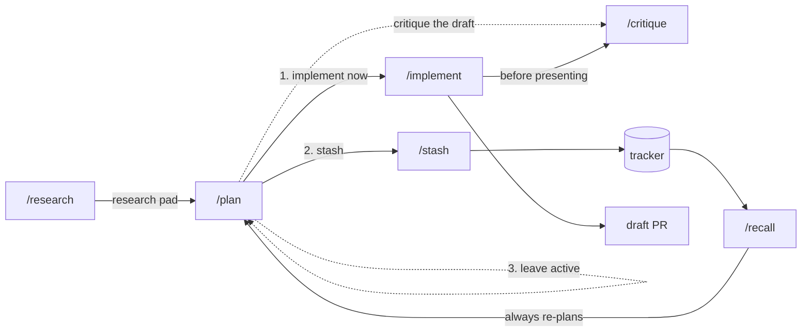

# agents

Claude Code configuration: always-on rules and a research → plan → implement workflow built on
the [Solo](https://soloterm.dev) MCP server.

## Install

```bash
./scripts/install.sh
```

| Link | Contents |
|---|---|
| `~/.claude/rules/<name>.md` | always-on working agreements — **linked per file** |
| `~/.claude/skills/<name>/` | slash commands — **linked per skill** |
| `~/.claude/references` | tracker adapters for `/stash` and `/recall` — whole directory |

Rules and skills are linked one at a time so `~/.claude/rules` and `~/.claude/skills` stay
real directories you own. Anything else you keep there is left alone, and nothing you create
locally ends up in this repository — which matters, since it is public.

`references/` is a whole-directory link because it is not a Claude Code directory. It exists
only so skills can read tracker adapters from a stable path, and nothing else writes there.

Re-run after **adding or renaming** a file; editing one takes effect immediately. Links into
this repo whose source has gone are pruned, and nothing else is touched. Anything real in the
way is moved to `~/.claude/backups/` first. Override the repo root with
`AGENTS_REPO=/path/to/agents`.

**This repository does not manage `~/.claude/settings.json` or `~/.claude/CLAUDE.md`.** Those
are machine-local and yours.

### Requirements

| | |
|---|---|
| Solo MCP | `/plan`, `/implement`, `/critique`, `/stash`, `/recall` |
| A tracker MCP | `/stash`, `/recall` — Linear adapter included |
| Nothing | `/research`, `/grill`, and the rules |

## Rules

Loaded into every session.

| Rule | Description |
|---|---|
| [pr-first-contributions](rules/pr-first-contributions.md) | PR-first git workflow, conventional titles, draft PRs, quality gates before presenting, approval before pushing |
| [testing-philosophy](rules/testing-philosophy.md) | Contract-first tests through production entry points; refactor-resistant |

## Skills

| Skill | Purpose | Invocation |
|---|---|---|
| [`/research`](skills/research/SKILL.md) | Map a codebase with parallel agents → a Solo scratchpad | you or Claude |
| [`/critique`](skills/critique/SKILL.md) | Adversarial multi-model review of a diff, plan, files, or PR | you or Claude |
| [`/grill`](skills/grill/SKILL.md) | Interrogate a decision one question at a time | you or Claude |
| [`/plan`](skills/plan/SKILL.md) | Research, grill, plan → one scratchpad, then implement / stash / park | **you only** |
| [`/implement`](skills/implement/SKILL.md) | Execute a plan as parallel waves, critique, present | **you only** |
| [`/stash`](skills/stash/SKILL.md) | Move active work into a durable tracker | **you only** |
| [`/recall`](skills/recall/SKILL.md) | Pull tracker work back into planning | **you only** |

Anything with side effects — writing code, committing, creating tracker objects — carries
`disable-model-invocation: true`, so Claude cannot decide to run it. Those four don't appear
in Claude's skill listing at all, which also means they cost no context until you invoke them.
The three advisory ones stay model-invocable and carry `when_to_use` trigger phrases, so
"grill me on this" or "tear this apart" work without remembering a command name.



## How state is divided

**Solo is the active working set.** Scratchpads hold research and plans; they are short-lived
and archived once the work ships. Todos exist only while a plan is being implemented. KV holds
small orchestration pointers.

**A tracker is the durable backlog.** Ideas parked for later, and large plans whose phases each
get their own research → plan → implement cycle. Nothing crosses that boundary automatically —
`/stash` and `/recall` are always explicit.

Nothing in this repository stores your work. Research and plans live in Solo, not in git.

| Kind | Name / key | Tags |
|---|---|---|
| Research pad | `research/<YYYY-MM-DD>T<HHMM>-<topic>` | `research`, `project:<repo>` |
| Plan pad | `plan/<YYYY-MM-DD>T<HHMM>-<topic>` | `plan`, `project:<repo>` |
| Phase todos | — | `plan:<slug>`, `project:<repo>`, `phase:N` |
| Orchestration | `plan:<slug>:{todos,branch:<repo>,escalation:<N>}` | — |

Skills use whichever Solo project is currently selected, and say which one in their first
confirmation.

## How the workflow behaves

**Gates carry evidence.** Every confirmation shows why it inferred what it did — which repos,
which files, which investigation — so a wrong guess is visible rather than buried.

**`/plan` grills you.** Questions come one at a time, each with a recommended answer, ordered so
the answer that changes the most other answers comes first. Anything discoverable from the
filesystem or tools is looked up rather than asked. Length scales with the work: one question
for a small change, twenty for a migration.

**Phases run in parallel where their declared files are disjoint.** `/implement` computes waves
from each phase's `**Files**:` list, spawns a Solo agent per phase, and joins on an idle timer.
Workers hold per-path locks and never touch git — the orchestrator commits each phase's declared
paths so history stays granular and nothing collides in the shared tree.

**Workers escalate on deviation, not on failure.** A worker that cannot self-resolve, or that
would need to depart meaningfully from the approved plan, records what it found and stops rather
than improvising. Other workers in the wave finish, and everything surfaces together.

**Critique is adversarial and multi-model.** `/critique` spawns a worker per model you select —
Claude, Copilot, Kimi, or anything else enabled in Solo — each trying to break the target rather
than survey it. Cross-model agreement ranks the findings; a defect two models independently find
is probably real.

## Adding a tracker

Drop an adapter in `references/` describing that tracker's object model and field mapping.
`/stash` and `/recall` own the semantics and read the adapter for the specifics, so a new
tracker is one file rather than two skills. See [`references/linear.md`](references/linear.md).
