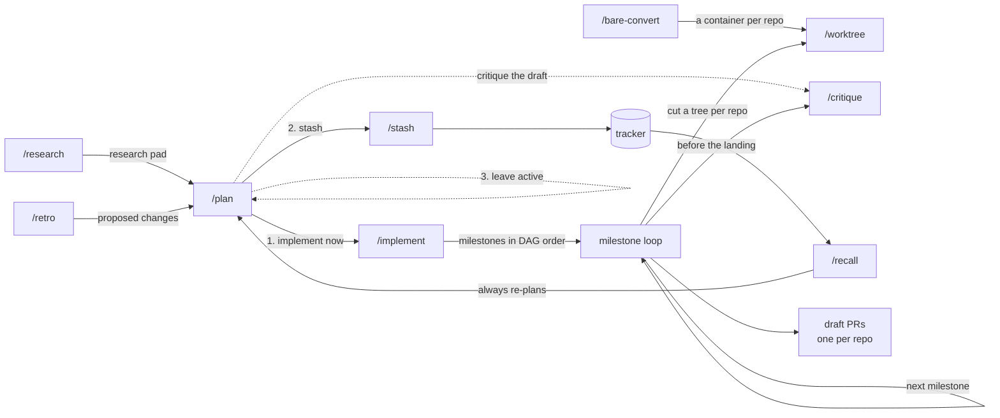

# agents

Claude Code and Codex configuration: always-on rules, plus a research, plan, and implement workflow built
on the [Solo](https://soloterm.dev) MCP server.

## Install

```bash
./scripts/install.sh
```

One run installs both runtimes.

| Destination | Contents | Runtime |
|---|---|---|
| `~/.claude/rules/<name>.md` | always-on working agreements — **linked per file** | Claude |
| `~/.claude/output-styles/<name>.md` | the output style — **linked per file** | Claude |
| `~/.claude/settings.json` | the `outputStyle` key only — **merged** | Claude |
| `~/.claude/skills/<name>/` | slash commands — **linked per skill** | Claude |
| `~/.claude/references` | adapters — whole directory, **never pruned** | Claude |
| `~/.claude/bin/wt-clone.sh` | the `/worktree` clone helper — **linked directly, never pruned** | both |
| `~/.agents/skills/<name>/` | the same skills — **linked per skill** | Codex |
| `~/.agents/references` | the same adapters — whole directory, **never pruned** | Codex |
| `~/.codex/AGENTS.md` | every rule and the output style concatenated — **generated** | Codex |

The script links one entry at a time, so each destination directory stays a real one you own.
It leaves anything else you keep there alone. Nothing you create locally reaches this
repository, which matters because the repository is public.

**`~/.codex/AGENTS.md` is the one file this repository generates whole rather than links.** Codex reads
its instructions from a single file and resolves no includes, so a directory of rules cannot
reach it any other way. A file you wrote yourself is backed up before the first generation. Git
hooks regenerate it after a commit, a checkout, and a merge, so a rule edit you commit reaches
Codex without a re-run. `./scripts/install.sh --rules-only` does that regeneration alone.

**Codex has no `disable-model-invocation`.** On Claude, the model cannot invoke `/bare-convert`
or `/stash`. On Codex it can invoke both itself. Each still gates on your approval before
anything lands, so the guarantee weakens from "you start it" to "you approve it".

`references/` is a whole-directory link because it is not a Claude Code directory. It exists so
a skill or a rule can read a file from a stable path. Nothing else writes there. It holds three
kinds. A tracker adapter serves `/stash` and `/recall`. A runtime adapter serves
`solo-agent-orchestration`, which points at it before you spawn that runtime. A skill's own
overflow holds what one skill cannot fit under its size cap, and `implement-waves.md` is the one
today. `runtime-claude.md` and `runtime-codex.md` are the runtime adapters. Each maps every
policy in that rule to the flag that implements it. Each also records the policies its runtime
cannot implement at all.

The `runtime-` prefix is load-bearing. A file named `claude.md` collides with `CLAUDE.md` on a
case-insensitive filesystem. Claude Code then loads the adapter as project instructions in every
session that opens this repository.

An adapter is content you need at one moment rather than in every session. Runtime launch flags
belong here because a wrong flag fails the launch with a visible error. A rule keeps anything
whose absence fails silently.

Re-run the script after you **add or rename** a file. An edit to an existing rule or skill takes
effect immediately. An edit to the output style does not. Claude Code reads a style once per
session, so see `## Output style`. The script prunes a per-entry link — a rule, an output style,
or a skill — whose source is gone. It never prunes the two direct links, `references/` and
`bin/wt-clone.sh`. A renamed source there leaves a dangling link. It moves anything real in the
way to `~/.claude/backups/` first. Override the repository root with
`AGENTS_REPO=/path/to/agents`.

**This repository manages one key in `~/.claude/settings.json`: `outputStyle`.** It never
overwrites a value you set, and it touches nothing else in that file. It does not manage
`~/.claude/CLAUDE.md` at all. Both files are machine-local and yours.

### Requirements

| | |
|---|---|
| Solo MCP | `/research`, `/plan`, `/implement`, `/critique`, `/retro`, `/worktree`, `/stash`, `/recall` |
| A tracker MCP | `/stash`, `/recall` — Linear adapter included |
| Vale 3.0 or later | checking the sentence-level half of `prose-discipline` — `brew install vale`. CI pins 3.17.1 |
| jq | selecting the output style at install time — without it the install prints the instruction instead |
| `gws` CLI, signed in | `/gws` |
| Nothing | `/grill`, `/bare-convert`, and the rules |

## Rules

All six rules load into every session.

| Rule | Description |
|---|---|
| [chat-vocabulary](rules/chat-vocabulary.md) | Six reserved headings and one footer mark every message the user must act on; nothing else gets a heading |
| [comment-discipline](rules/comment-discipline.md) | Comments are disallowed by default; after the implementation, propose only the few that pass the admission test |
| [pr-first-contributions](rules/pr-first-contributions.md) | PR-first git workflow with conventional titles, draft PRs, stacked bases, and squash-merge descriptions |
| [solo-agent-orchestration](rules/solo-agent-orchestration.md) | Fan out with Solo agents, never a vendor's native sub-agent mechanism. Workers signal their own completion and report to a durable surface |
| [testing-philosophy](rules/testing-philosophy.md) | Contract-first tests through production entry points; refactor-resistant |
| [yagni](rules/yagni.md) | Build for the present need; defer what is cheap to add later |

Each description above copies that rule's `description:` frontmatter. Copy it rather than
paraphrase it, because a paraphrase drifts from the rule it describes.

## Output style

[prose-discipline](output-styles/prose-discipline.md) is a Claude Code output style, not a rule. It
combines the two standards that used to live in `rules/`: how much you say, and how you say it. The
first led with the answer and stopped when done. The second applied ASD-STE100 to every sentence.
They left `rules/` because a style gets something a rule cannot: a per-turn reminder. Release
2.1.238 exists to stop a custom style drifting back to the default voice mid-session. Both
standards fail by gradual drift. Shipping them as one style also states them once per session
rather than twice.

Three mechanisms come with a style:

- **A style takes effect at session start only.** An edit to the file needs `/clear` or a new
  session. A newly linked style file needs a new session. Claude Code caches the set of available
  styles for the life of the process.
- **Only one style is active at a time.** Another style therefore drops both standards at once.
- **It applies to all prose.** An artifact runs to whatever length its purpose requires.
- **It drops Claude Code's `# Doing tasks` section.** The style omits
  `keep-coding-instructions`, so the built-in scoping, comment, and verification guidance leaves
  the system prompt. `yagni` and `comment-discipline` cover scope and comments more strictly. The
  security guidance and the verification instruction go, and no file here replaces them.

The installer links the style and sets `"outputStyle": "prose-discipline"` in
`~/.claude/settings.json`. It leaves an `outputStyle` you set yourself alone, and it skips that step
when `jq` is absent. Codex has no output style, so `~/.codex/AGENTS.md` concatenates the style
alongside the rules.

### Checking prose

Vale checks the sentence-level half of `prose-discipline` mechanically: sentence length, voice,
verb form, and contractions. It checks none of the imperatives. "Lead with the answer", "one shape
per fact", and "stop when done" pass Vale whatever you write. Both mechanisms exist because
Vale covers committed markdown, and the per-turn style reminder covers chat, which Vale never
reads.

The two directories are one word apart. `styles/` holds the Vale rules that check the prose, and
`output-styles/` holds the Claude output style itself. `.vale.ini` and the hand-authored
`styles/STE/` Vale style live in this repository. Run Vale over the markdown you changed:

```bash
vale --minAlertLevel=warning <file>.md
```

The 25-word sentence cap and the contraction check are errors. The 20-word cap, the
passive-voice check, and the gerund check are warnings, because each one needs your judgment.

The passive-voice and gerund checks use Vale's `sequence` extension, which reads part-of-speech
tags. They match a `be` form followed by a past participle or a present participle. Vale 3.17.0
or later is required, because earlier versions read sentences from paragraphs only.

A tagger reads word forms, not meaning, so both checks report some sentences that are correct.
`The waves are done` tags `done` as a past participle even though it acts as an adjective here.
Both checks are warnings for that reason: read each one and decide.

## Skills

| Skill | Purpose | Invocation |
|---|---|---|
| [`/research`](skills/research/SKILL.md) | Investigate a codebase with parallel Solo agents and write the findings to a Solo scratchpad | you or the agent |
| [`/critique`](skills/critique/SKILL.md) | Adversarial multi-model review of a diff, plan, files, or PR | you or the agent |
| [`/grill`](skills/grill/SKILL.md) | Interrogate a decision one question at a time | you or the agent |
| [`/retro`](skills/retro/SKILL.md) | Analyse past sessions for recurring failures and hand the findings to `/plan` | you or the agent |
| [`/worktree`](skills/worktree/SKILL.md) | Cut, provision, and tear down one milestone worktree | you or the agent |
| [`/plan`](skills/plan/SKILL.md) | Research, grill, and produce a plan in one Solo scratchpad | you or the agent |
| [`/implement`](skills/implement/SKILL.md) | Compose a plan into milestones, and ship each one as its own PRs | you or the agent |
| [`/recall`](skills/recall/SKILL.md) | Pull tracker work back into planning | you or the agent |
| [`/gws`](skills/gws/SKILL.md) | Read and change Google Drive, Docs, Sheets, and Slides files through the `gws` CLI | you or the agent |
| [`/bare-convert`](skills/bare-convert/SKILL.md) | Set up or convert a repository into the bare-plus-worktrees layout | **you only** |
| [`/stash`](skills/stash/SKILL.md) | Move active work into a durable tracker | **you only** |

Two skills keep `disable-model-invocation: true`, so the agent cannot decide to run either.
`/bare-convert` moves your working tree, and `/stash` creates tracker objects and deletes todos
and KV. Neither appears in the agent's skill listing, so they cost no context until you invoke
them.

The other nine stay model-invocable. Six of them carry `when_to_use` trigger phrases. Say
"grill me on this" or "find the bugs" and the skill runs without a command name. `/plan`,
`/implement`, and `/recall` carry none, so a command name still starts each one. They are
model-invocable because they call each other. `/recall` hands to `/plan`, and `/plan` calls
`/implement`. A disabled skill cannot call another disabled skill.

`/worktree` and `/gws` are the two trigger-phrase skills that also write. `/implement` calls
`/worktree` per milestone, so it must be callable. Its destructive half lives in `/bare-convert`,
which keeps the gate. `/gws` confirms every write with you before it sends one.

**No skill overrides the model.** Every skill respects your session's choice, including a `[1m]`
variant. A skill sets `effort` only where the shape of the work justifies it:

| Skill | `effort` | Why |
|---|---|---|
| `grill` | `xhigh` | pure judgment, no fan-out to multiply the cost |
| `stash`, `recall` | `medium` | mechanical mapping against an explicit adapter |
| the rest | inherits | a raise multiplies across their parallel agents |

An effort override applies for the rest of the turn, and it resets on your next prompt. For
one-off depth, put `ultrathink` in the prompt instead.


```mermaid
flowchart LR
    R["/research"]
    P["/plan"]
    I["/implement"]
    W["/worktree"]
    BC["/bare-convert"]
    M["milestone loop"]
    C["/critique"]
    S["/stash"]
    RC["/recall"]
    RT["/retro"]
    T[("tracker")]
    PR["draft PRs<br/>one per repo"]

    R -->|"research pad"| P
    P -->|"1. implement now"| I
    P -->|"2. stash"| S
    P -.->|"3. leave active"| P
    P -.->|"critique the draft"| C
    S --> T
    T --> RC
    RC -->|"always re-plans"| P
    RT -->|"proposed changes"| P
    I -->|"milestones in DAG order"| M
    BC -->|"a container per repo"| W
    M -->|"cut a tree per repo"| W
    M -->|"before the landing"| C
    M --> PR
    M -->|"next milestone"| M
```

## How the system divides state

**Solo is the active working set.** Scratchpads hold research and plans. They are short-lived,
and you archive them once the work ships. Todos exist only while `/implement` runs a plan. KV
holds small orchestration pointers.

**A tracker is the durable backlog.** It holds an idea you parked for later. It also holds a
large plan whose work items each get their own research, plan, and implement cycle. Nothing
crosses that boundary automatically: `/stash` and `/recall` are always explicit.

Nothing in this repository stores your work. Research and plans live in Solo, not in git.

| Kind | Name / key | Tags |
|---|---|---|
| Research pad | `research/<YYYY-MM-DD>t<HHMM>-<topic>` | `research`, `project:<repo>` |
| Plan pad | `plan/<YYYY-MM-DD>t<HHMM>-<topic>` | `plan`, `project:<repo>` |
| Task todos | — | `plan:<slug>`, `milestone:<m>`, `project:<repo>`, `task:<letter>` |
| Worker reports | `<slug>/<milestone>/<task>` | — |
| Orchestration | `plan:<slug>:milestone:<m>:branch:<repo>` | — |
| Orchestration | `plan:<slug>:milestone:<m>:worktree:<repo>` | — |

Skills use whichever Solo project is currently selected, and say which one in their first
confirmation.

## How the workflow behaves

**Every worker is a Solo agent.** `/research`, `/plan`, `/implement`, `/critique`, and `/retro`
fan out with `spawn_agent`, never with the host runtime's own sub-agent mechanism.
[solo-agent-orchestration](rules/solo-agent-orchestration.md) carries the policy and the
reasoning, so the policy also holds for a fan-out that no skill started. Each skill carries only
its own worker brief and constraints.

**Every worker launches in auto-approval mode.** A read-only assignment is no exception, and no
worker uses a bypass mode. Each runtime names its own flags, and it renames them between releases.
Read `references/runtime-<tool_type>.md` for the arguments rather than a list here.

**Workers signal their own completion.** Each worker wakes the orchestrator through a
one-millisecond timer as its last act, because only the worker knows that it finished. Solo
rejects a zero delay, so that is the smallest legal value. An idle timer stays as
the fallback that catches a worker which died or hung. An idle timer has no debounce, and a
worker that reasons at length emits no output and looks finished.

**Gates carry evidence for what they inferred.** A confirmation justifies the judgments it could
get wrong: why these repos, why these investigation areas, why this is out of scope. A bad guess
is then visible rather than buried. A gate prints a looked-up fact without argument. The
selected Solo project needs no justification; a repo list inferred from file references needs
one. A gate's opening message carries a reserved heading and fences its block, per
[chat-vocabulary](rules/chat-vocabulary.md). `Approve` marks a proposal, and `Deciding` marks a
question you cannot answer yourself.

**`/plan` grills you.** One question per message, never two. Each one carries a fenced context
block, a mandatory recommendation, and the `⏸` footer. Only the first question carries the
`Deciding` heading, so a long grilling does not become a column of headings. The
question whose answer changes the most other answers comes first. `/plan` looks up anything the
filesystem or a tool can tell it, rather than asking you. Its scope gate names the decisions it
expects to put to you. That gate also reports how far each tree sits behind its default branch.
It stops when the questions left are details you would rather see than specify.

**`/plan` censuses the inbound references before it writes the pad.** It searches for three
kinds of reference to every file a slice changes. Those kinds are the caller, the test, and the
standard whose text the change makes false. The third kind is the one that gets missed, because
no import points to it. Nineteen of thirty sessions shipped an incomplete file list before this
step existed.

**Three words carry the delivery model, and each means one thing.** A **slice** is one worker's
unit of work: narrow, vertical, one repository. A **milestone** is a consumable chunk of a plan
and the unit of delivery, and it may span repositories. A **wave** is the concurrency schedule
inside a milestone, taken from file overlap.

**The plan declares slices; `/implement` composes the milestones.** A plan declares slices with
their file scopes. It also declares the two constraints only it knows: which slices must share a
worker, and which must follow another. Composing slices into milestones, ordering those
milestones, and choosing a model and effort are scheduling. `/implement` decides the schedule at
execution time, against facts that are current then.

**A milestone lands one PR per repository it touches.** Its outcome is one sentence with no
`and`, and each of its PR titles states that outcome scoped to its repository. Two milestones
that touch one file ship in sequence, because their branches would otherwise conflict. A
milestone gets its own worktree per repository through `/worktree`, so no worker ever shares
your tree.

**You approve the roster before anything spawns.** `/implement` presents the milestones and
their PR titles first, then the waves and tiers inside each one. `/implement` writes each summary
so the tier follows from it. A task described as "three localized edits against precise line
references" argues for its own tier. Adjust any milestone boundary, model, effort, or grouping,
or approve the roster as proposed.

**Both runtimes bound an immutable-target worker's writes by directory.** That worker reads the
target and writes only scratch, and the operating system enforces the bound. On Claude the
sandbox covers Bash alone. `Read`, `Edit` and `Write` use the permission system, so the brief
also needs a tool deny list. Codex keeps `/tmp` and `$TMPDIR` writable, so it does not isolate
one worker's scratch directory from another's. Each runtime adapter carries the arguments and
the date of its last measurement.

An editing worker is the harder case. No directory-scoped posture denies git in the worktree the
worker edits. Claude denies `git add` per command, and Codex has no per-worker equivalent. The
rule requires that gap disclosed rather than restated as a promise. `/worktree` cuts one tree per
milestone and per repository, so several workers share one. Two Codex workers that stage in that
tree cross-commit silently. `/implement` discloses the exposure at the roster gate, and it does
not close it. A worker takes a lock only where a second run or a person may edit the same tree.
The orchestrator commits each task's declared paths, so history stays granular.

**Workers escalate on deviation, not on failure.** A worker that cannot self-resolve records
what it found and stops. So does a worker that would have to depart meaningfully from the
approved plan. Neither one improvises. The record is the worker's report scratchpad, and its
completion signal says that it escalated, so you have one place to look. Other workers in the
wave finish, and everything appears together at the join.

**Critique is adversarial and multi-model.** `/critique` spawns one worker per model you select:
Claude, Copilot, Kimi, or anything else enabled in Solo. Each worker tries to break the target
rather than survey it. Cross-model agreement is evidence that a defect is real, because two
models rarely invent one defect. One model gives no such evidence, so a refutation pass takes its
place and drops what it refutes. Agreement raises confidence, and it drops nothing. Every merged
finding reaches the filter, whether one critic found it or every critic did.

**A filter decides which findings reach you.** `/critique` accepts a finding by default. What
acceptance does then depends on who called. A milestone critique inside `/implement` applies the
fix; a standalone or `--integration` pass reports the remedy and edits nothing. Six criteria
escalate a finding to you instead:

```
C1  the fix rests on a fact the orchestrator cannot verify
C2  the fix needs you to act outside the repository
C3  the fix is irreversible, or visible outside the repository
C4  the fix changes a default posture
C5  the fix changes who decides, or who merges
C6  two fixes exist, and neither one ranks above the other on stated grounds
```

Three grounds never escalate: a nit, cross-model agreement, and a mechanical fix to a verifiable
mismatch. Serial triage cost about 115 of your turns across 8 runs. Delegated triage cost about
20 across 14.

**The ledger discloses every decision.** One line per finding, ranked by criticality. Each line
carries the claim, the action, and the alternative the orchestrator declined. The ledger is where
you correct a remedy choice, because C6 covers a genuine tie alone. `/implement` reports it with
each milestone landing, so nobody triages a finding twice.

**`/implement` critiques each milestone, not the whole run.** That critique and any escalation
block the next milestone, because a finding may change what it should do. Your review of the PR
blocks nothing. The run opens the PR, reports the landing, and starts the next milestone.

**A separate integration pass sees only what one milestone cannot.** Its lenses are
cross-milestone contract drift, plan completeness, claim consistency, and stack coherence. It may
not raise a finding that lives wholly inside one milestone's diff. That milestone already put the
finding through the filter.

## Adding a tracker

Add an adapter to `references/` that describes that tracker's object model and field mapping.
`/stash` and `/recall` own the semantics and read the adapter for the specifics. A new tracker
is therefore one file rather than two skills. See
[`references/linear.md`](references/linear.md).
